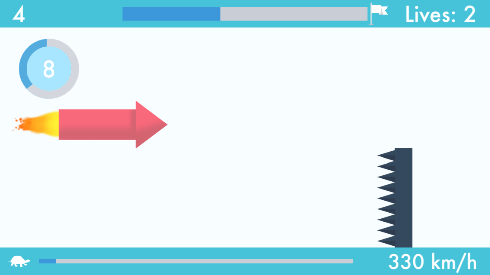

# Rocket Blast! (iOS)

This is a mobile game that was released on the Apple App Store in September 2015. It was developed using SpriteBuilder and Xcode and was written using Objective-C.

## Overview

The main objective of the game is to dodge oncoming obstacles using a rocket that is controlled by the device's gyroscope and accelerometer. The rocket can move up or down and its speed can also change depending on how the device is moved by the user. A set number of obstacles must be dodged within a given amount of time.

